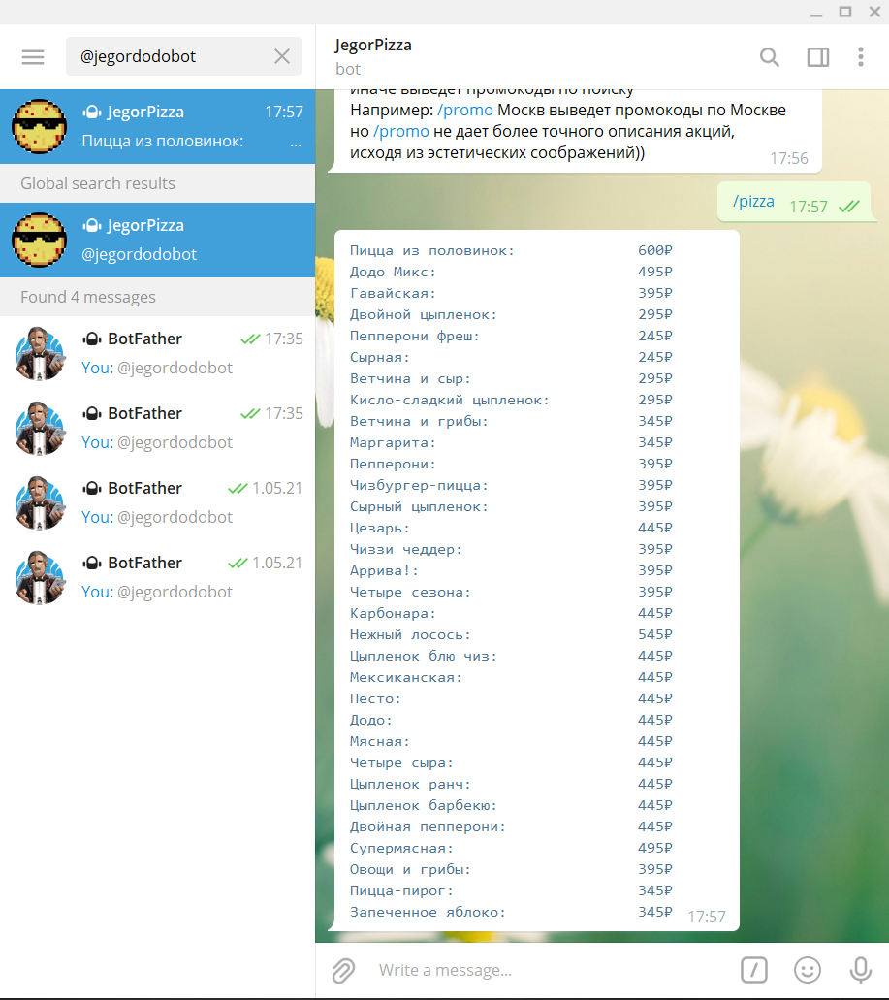
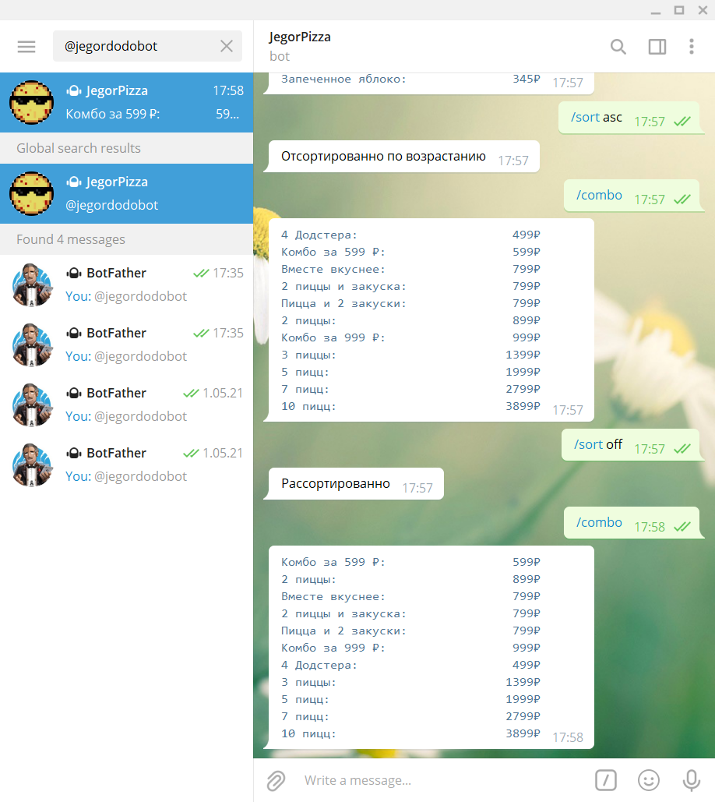
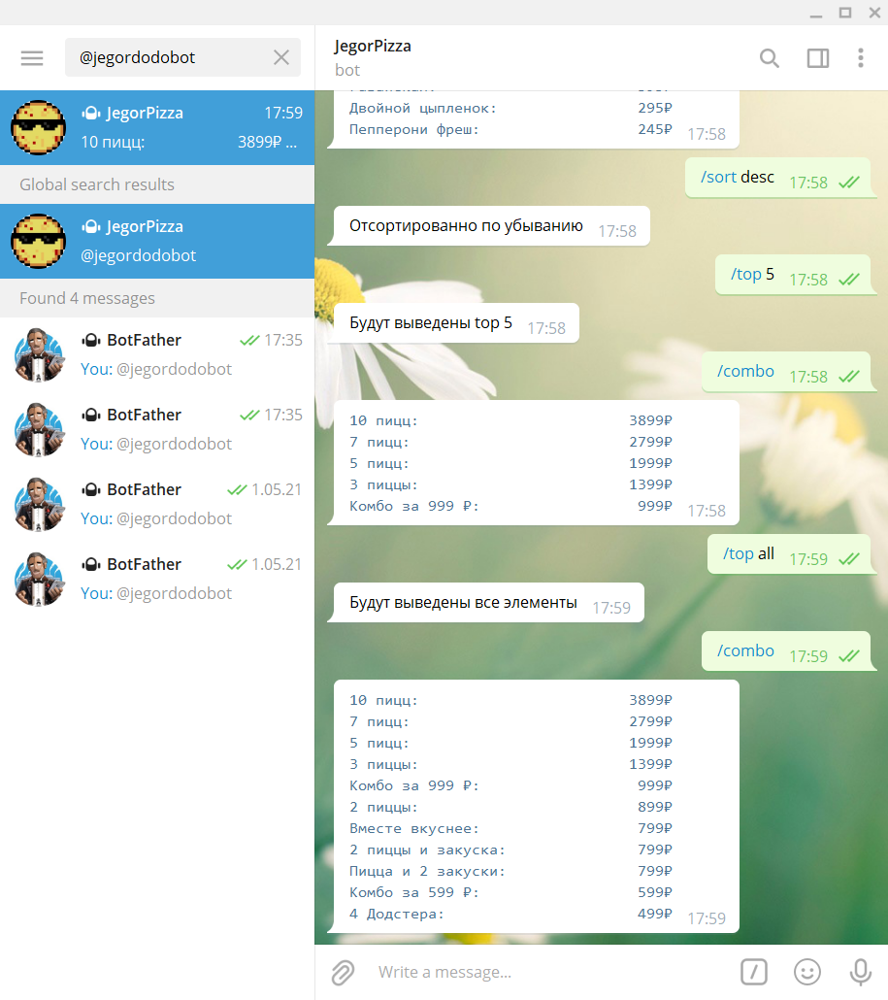
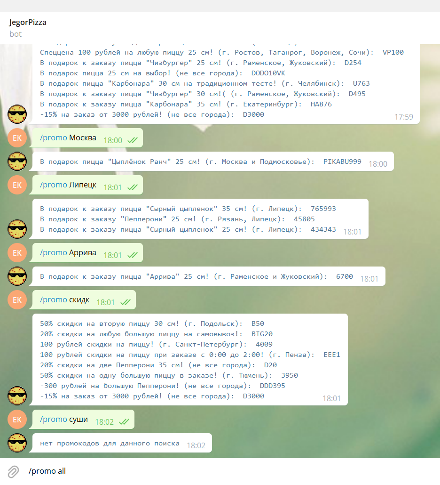
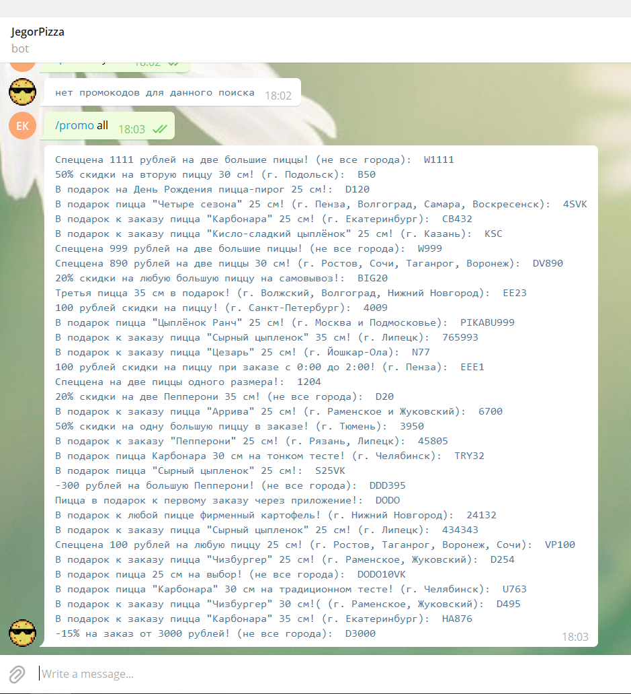

# Бот для парсинга Додо пиццы и вывода промокодов
# Егор Кратков

Как запустить проект:
1. загрузить все файлы в pycharm проект.
2. с помощью docker:
```
docker build -t dodo-bot
docker run dodo-bot
```


### Описание:
Этот бот предназначен для того, чтобы парсить ДОДО пиццу и промокоды на нее с pikabu\
Чтобы добавить бота в телеграмм нужно прописать @jegordodobot в поиске.
Он работает локально, поэтому, чтобы его запустить, нужно запустить проект

### Импорты:
Дополнительные не встроенные библиотеки:
> aiogram - для телеграмм бота\
  requests - для запросов на сайт\
  bs4 - для парсинга 
  
встроенные в pycharm: 
> logging - для логов\
  re - регулярные выражения\
  sqlite3 - работа с БД\
  unittest - тестирование
  

### Команды:
/start - выводит описание и запускает парсинг додо\
https://dodopizza.ru/ \
/help -выводит описание\
menu - собирает данные с додо и предлагает ввести одну из команд:
> /pizza - вывод всех пицц с сайта додо\
  /combo - вывод всех комбо с сайта додо\
  /bonus - вывод всех дополнительных блюд с сайта додо



/sort - сортирует:\
/sort asc - по возрастанию\
/sort desc - по убыванию\
/sort off - рассортирует



/top n - выводит n > 0 элементов\
/top all - выводит все элементы




/promo - парсит промокоды с pikabu\
https://promokod.pikabu.ru/shops/dodopizza \
/promo {find_str} - выводит промокоды по поиску find_str



/promo all - выводит все действующие промокоды




### Список версий:
- 1.0: изначальная версия, возможно и конечная))


### Описание файлов:
- **Images** - папка с картинками и скринами\
piskel - папка с исходниками, нарисованными в https://www.piskelapp.com/ 
- **main_commit.txt** - коммит в main
- **server.db** - sql файл

Файлы с кодом:
1. **main.py** - создает бота, запускает polling, взаимодействует с пользователем
2. **Testing.py** - тестирует программу
3. **myConfig.py** - содержит некоторые данные 
4. **mySQLite.py** - работает с БД: создает таблицу, добавляет и удаляет оттуда элементы и может выводить
5. **myDodoRequest.py** - содержит класс для работы с додо
- get_request(link) - подключается к сайту и записывает html данные в переменную soup
- soup_find_menu() - находит данные для меню, вызывает soup_find_name и soup_find_price
- make_menu_str(str_type) - создает строку в зависимости от str_type(pizza, combo, bonus) и отправляет ее для печати
6. **myPromoRequest.py** - содержит класс для работы с промокодами
- get_request(link) - подключается к сайту и записывает html данные в переменную soup
- soup_find_promo(find_str) - находит данные для промокодов по поиску find_str
- make_menu_str(str_type) - создает строку и отправляет ее для печати
